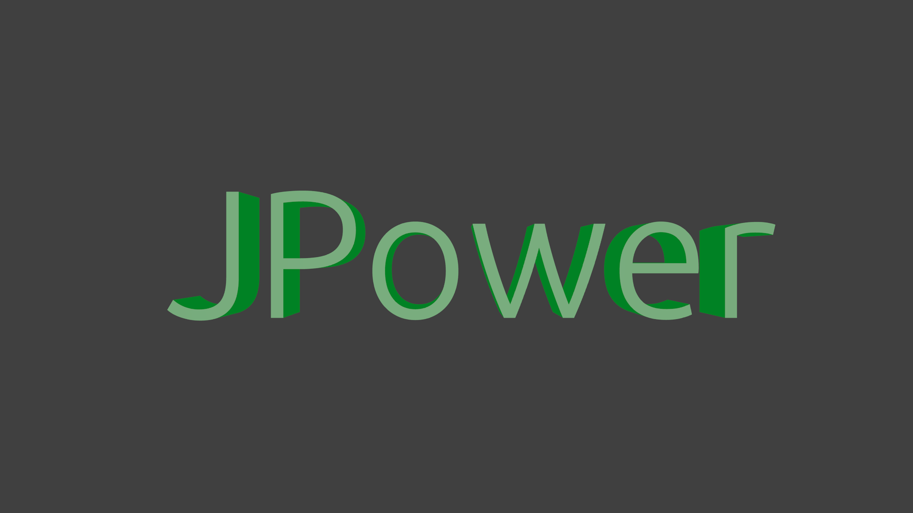

# JPower 

JPower is a modular set of libraries similar to Apache Commons and Guava, with a twist. It's written to be used with Java 8's new features!

# Authors

- Logan Gorence - Project Leader
- Kenneth Endfinger - Creator and Developer

# Links

- [Issue Tracker](https://github.com/DirectMyFile/JPower/issues)
- [Wiki](https://github.com/DirectMyFile/JPower/wiki)
- [JavaDoc](https://kaendfinger.ci.cloudbees.com/job/JPower/javadoc/)

# Contact Us

The JPower team can be found on [EsperNet](http://esper.net/) in [#directcode](http://www.directmyfile.com/)
