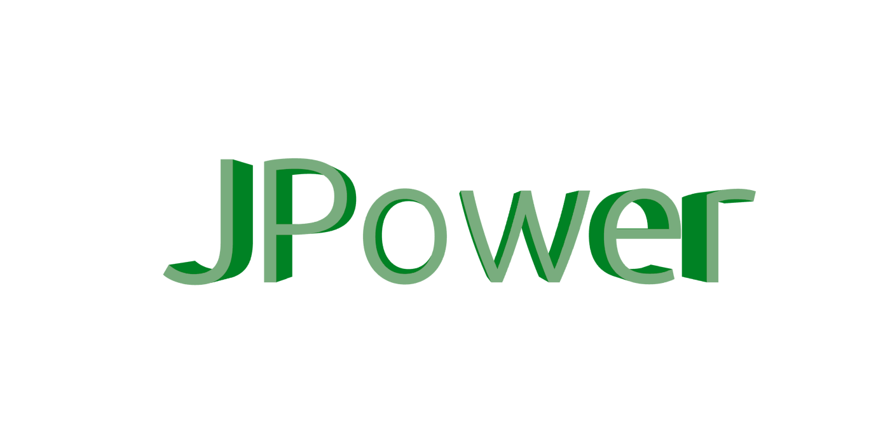

# JPower 

JPower is a modular set of libraries similar to Apache Commons and Guava, with a twist. It's written to be used with Java 8's new features!

# Authors

- Logan Gorence - Project Maintainer
- Kenneth Endfinger - Creator and Developer

# Links

- [Issue Tracker](http://goo.gl/C5NIcU)
- [Wiki](http://goo.gl/ua6HNX)
- [TeamCity](http://goo.gl/x0mb1X)
- [JavaDoc](http://goo.gl/m2v7rb)

# Contact Us

The JPower team can be found on [EsperNet](http://esper.net/) in [#directcode](http://goo.gl/EA5bNW)

# Sponsors

JPower is sponsored by JetBrains!

